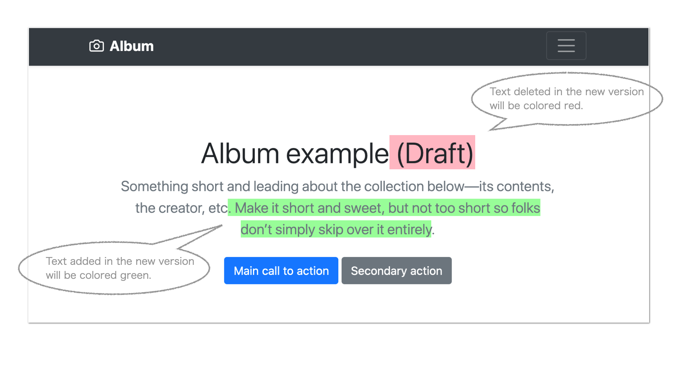

# htmldiff

[](https://opensource.org/licenses/MIT) [](https://circleci.com/gh/kemokemo/htmldiff) [](https://codecov.io/gh/kemokemo/htmldiff) [](https://goreportcard.com/report/github.com/kemokemo/htmldiff)

This tool compares old and new versions of html and generates color-coded html in a diff format.



## Install

### Homebrew

```sh
brew install kemokemo/tap/htmldiff
```

### Scoop

First, add my scoop-bucket.

```sh
scoop bucket add kemokemo-bucket https://github.com/kemokemo/scoop-bucket.git
```

Next, install this app by running the following.

```sh
scoop install htmldiff
```

### Binary

Get the latest version from [the release page](https://github.com/kemokemo/htmldiff/releases/latest), and download the archive file for your operating system/architecture. Unpack the archive, and put the binary somewhere in your `$PATH`.

## Usage

```sh
$ htmldiff -h
Usage: htmldiff [<option>...] <old html> <new html>
  -h	display help
  -nh
    	true: use new header, false: use old header (default true)
  -o string
    	output filename (default "diff.html")j
```

When comparing two html files, you need to choose which header to use. By default, it uses the new header. To use the header of the old html file, set `-nh=false` flag. ( `-nh` means "use **n**ew **h**eader". )

### Example

```sh
htmldiff -o=diff/index.html v1/index.html v2/index.html
```

If you use the header of `v1/index.html`, set `-nh=false` flag.

```sh
htmldiff -o=diff/index.html -nh=false v1/index.html v2/index.html
```

## Information for developers

### How to build

It is recommended to build with the go module.

If you don't use the `go module`, you need to `go get` the following libraries before building.

- github.com/andybalholm/cascadia
- github.com/documize/html-diff
- github.com/gobuffalo/packr/v2

I would like to take this opportunity to thank the authors of these wonderful libraries and tools. Thank you!

### Note

Tool `packr2` is used to convert template file `template/index.html` to `packrd/packed-packr.go` for inclusion in the binary. Tool `packr2` is installed as follows.

```sh
go get -u github.com/gobuffalo/packr/v2/packr2
```

For more information, please visit [the official website](https://github.com/gobuffalo/packr/tree/master/v2).

## License

[MIT](https://github.com/kemokemo/htmldiff/blob/main/LICENSE)

## Author

[kemokemo](https://github.com/kemokemo)

